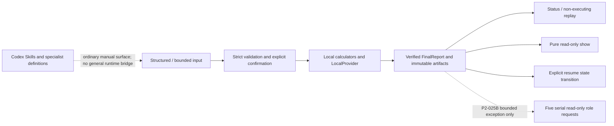

# poker-deliberation-framework

監査可能なポーカー計算と、範囲を固定したNLHE事後レビューのためのlocal-first Python toolkitです。
入力、仮定、計算結果、承認、provenance、保存artifactを分離し、どこまでが確認済みかを追跡できます。
現在は実験的な`0.1.0`であり、公開済みrelease、tag、PyPI packageはありません。

## 最初に実行するコマンド

Python 3.12の環境を作り、repository rootで次を実行します。

Windows PowerShell:

```powershell
py -3.12 -m venv .venv
$python = ".\.venv\Scripts\python.exe"
& $python -m pip install -e .
& $python -m poker_deliberation doctor
```

POSIX shell:

```bash
python3.12 -m venv .venv
python="./.venv/bin/python"
"$python" -m pip install -e .
"$python" -m poker_deliberation doctor
```

最初のdependency取得にはnetworkが必要な場合があります。install完了後、既定の`local_only`経路は
API key、保存済みChatGPT/Codex login、外部model、networkを使わずに実行できます。

`doctor`最上位の`status=ok`は診断が完了したという意味です。個別能力には`disabled`または
`unavailable`もあるため、同じ出力の`capabilities`を確認してください。

## 現在できること

- strict schemaとtyped resultを使って、pot odds、EV、ICM、heads-up NLHE equity、combo、
  small finite gameなどの登録済みローカルcalculatorを実行する。
- 構造化hand、限定key-value形式、文書化済みの有限な日本語NLHE cash grammarをfail closedで検証する。
- 確認済みのriver terminal-fold履歴と明示された単一opponent rangeを、exact heads-up river equityと
  zero-rake call-EVの限定レビューへ接続する。
- 限定レビューをcanonical workflowとして保存し、status、resume、replayを行う。
- P3-030Eの`show-bounded-river-review`で、既存のverified `FinalReport`とworkflow/bridgeの
  hash・stateだけをread-only表示する。表示はparser、calculator、provider、modelを再実行しない。

ここでP3-030Eの`verified FinalReport`とreport projectionは、repository-ownedなschema、hash、
workflow/bridge linkage、state、numeric-contractの検査に合格したことを意味します。戦略品質、
実戦rangeの正確性、GTO/equilibrium、外部solver一致、第三者認証、release readinessは証明しません。

- P3-030Fの`show-bounded-river-review-role-request`から始まるworkflow wrapperで、nonlocal modeの
  次の1 roleだけをpreview、全fieldの明示確認、workflow-ownedなcanonical hash receiptの保存、
  1回のexecuteという順で監督実行する。
- P3-030Gのfirst-class deterministic production-workflow qualification harnessで、repository-owned
  fixtureを実際のproduction preview、17-field confirm、single-role execute wrapperへ固定5 roleの順に通し、
  sanitized self-hashed canonical manifestを生成する。
- Codex上で同梱Skillと専門agent定義を利用する。通常のCodex利用とPython CLIは別実行面であり、
  P2-025Bだけがterminal検証済みの限定river reviewを固定5 roleへ渡す専用bridgeである。

簡単なcalculator確認は次のコマンドです。

```powershell
.\.venv\Scripts\python.exe -m poker_deliberation calculate pot_odds `
  --analysis-scope retrospective `
  --input examples\pot_odds_input.json
```

全CLI、tool、Python roleは次で確認できます。

```powershell
.\.venv\Scripts\python.exe -m poker_deliberation --help
.\.venv\Scripts\python.exe -m poker_deliberation list-tools
.\.venv\Scripts\python.exe -m poker_deliberation list-agents
```

## 限定river reviewを実行する

次はrepository-owned synthetic examplesを使う、PowerShell向けのcopyableな
prepare → 人手preview確認 → 12-hash confirm → run → verified report表示です。
clean checkoutのrepository rootで実行してください。各実行に新しいIDを使うため、既存runを上書きしません。

```powershell
$python = ".\.venv\Scripts\python.exe"
$token = [Guid]::NewGuid().ToString("N")
$workflowId = "river-review-$token"
$workflowRoot = ".\tmp\runs\$workflowId"
$commit = (git rev-parse HEAD).Trim()
$tree = (git rev-parse 'HEAD^{tree}').Trim()

$previewJson = & $python -m poker_deliberation prepare-bounded-river-review `
  --source .\examples\bounded_river_review_source_ja.txt `
  --range .\examples\bounded_river_review_range.json `
  --workflow-root $workflowRoot `
  --workflow-id $workflowId `
  --intake-id "intake-$token" `
  --source-run-id "source-$token" `
  --bridge-run-id "bridge-$token" `
  --source-id "repository-example-$token" `
  --repository-root . `
  --repository-commit $commit `
  --repository-tree $tree `
  --auth-mode local_only `
  --source-kind repository_fixture `
  --license-classification repository_owned_mit `
  --usage-classification redistribution_allowed `
  --classification public `
  --format json

$previewJson | Out-Host
$preview = ($previewJson -join "`n") | ConvertFrom-Json
$null = Read-Host "source、range、focal、tool plan、plan hash、12個のhashを確認後にEnter"

& $python -m poker_deliberation confirm-bounded-river-review `
  --workflow-root $workflowRoot `
  --workflow-id $workflowId `
  --repository-root . `
  --authority-id "local-user" `
  --confirmation-id "confirmation-$token" `
  --idempotency-key "confirmation-$token" `
  --expected-plan-sha256 $preview.plan_sha256 `
  --expected-source-sha256 $preview.expected_hashes.source_sha256 `
  --expected-bounded-candidate-sha256 $preview.expected_hashes.bounded_candidate_sha256 `
  --expected-source-bindings-sha256 $preview.expected_hashes.source_bindings_sha256 `
  --expected-focal-sha256 $preview.expected_hashes.focal_sha256 `
  --expected-extractor-sha256 $preview.expected_hashes.extractor_sha256 `
  --expected-tool-plan-sha256 $preview.expected_hashes.tool_plan_sha256 `
  --expected-range-definition-sha256 $preview.expected_hashes.range_definition_sha256 `
  --expected-range-target-sha256 $preview.expected_hashes.range_target_sha256 `
  --expected-range-binding-sha256 $preview.expected_hashes.range_binding_sha256 `
  --expected-equity-model-sha256 $preview.expected_hashes.equity_model_sha256 `
  --expected-call-ev-model-sha256 $preview.expected_hashes.call_ev_model_sha256 `
  --expected-candidate-sha256 $preview.expected_hashes.candidate_sha256

& $python -m poker_deliberation run-bounded-river-review `
  --source .\examples\bounded_river_review_source_ja.txt `
  --workflow-root $workflowRoot `
  --workflow-id $workflowId `
  --repository-root .

& $python -m poker_deliberation show-bounded-river-review `
  --workflow-root $workflowRoot `
  --workflow-id $workflowId `
  --repository-root . `
  --format markdown
```

確認は自動承認ではありません。previewの意味と入力が意図どおりかを利用者自身が確認した上で、
表示された12個のhashをそれぞれの明示flagへ渡します。`local_only`はmodel/nonlocal runtimeを
開始せず、完了後のreport viewも保存済みverified artifactだけを読みます。

P3-030Fでnonlocal roleを監督実行する場合、各roleの最初のコマンドは
`show-bounded-river-review-role-request`です。statusの`next_role`と`role_state`を確認し、previewの
17個の`confirmation_fields`をすべて個別の`--expected-*`として
`confirm-bounded-river-review-role-request`へ渡して確認した後、
`execute-bounded-river-review-role`を1回だけ実行します。confirm成功時には、workflow plan、linkage、
bridge lineage、role、17 field、P2 confirmationを結ぶ`binding_sha256`付きのrole confirmation receiptを
workflow側へ保存します。既存のlower-level P2 CLIで直接confirmしただけではworkflowの実行許可にならず、
receiptがない間は`awaiting_confirmation`です。P2 confirmationだけが残った中断は、fresh showの値と
同じauthority/confirmation/idempotency IDを明示してworkflow confirmを行うとreceiptを作成できます。
次のroleでも同じ3段階を繰り返します。

ここでrole confirmationは、previewされた全fieldへの利用者の明示的一致をworkflow receiptへ
hash束縛する手続です。利用者の本人認証、戦略判断の承認、外部第三者検証、model/providerの
現在資格を意味しません。

P3-030Gのdeterministic fixtureは、fresh previewの17 fieldをfixture管理のlocal authorityで
production confirmへ正確に渡し、confirmだけではroleが実行されないことを確認してから、評価専用の
deterministic read-only executor seamを通して各roleを1回ずつ実行します。外部model、provider、network、
credentialは使いません。この機械的な確認は人間の確認やactual-live/provider qualificationではありません。

statusは`role_request_expires_at`と`role_confirmation_expires_at`も表示します。期限切れは
`role_state=expired`となり、role wrapperは`BRW_E_ROLE_EXPIRED`で停止します。
`reconciliation_required`のterminalまたは`in_progress`も自動retryしません。
`local_only`では、このrole用show/confirm/execute wrapperは`BRW_E_LOCAL_ONLY`で拒否されます。
自動確認、期限切れの自動再確認、一括または並列実行、retry、skip、新しいmodeへの切替、
mode/model/provider fallbackはありません。既存の
P3 `FinalReport`、parser/calculator、明示済み単一opponent range、7-tool exact semanticsは変わりません。
`codex_subscription`の現行qualificationは`UNKNOWN`です。具体的な全flag、状態遷移、resume、replay、
保存範囲は
[限定river review workflow](docs/bounded-river-review-workflow.md)を参照してください。
P3-030Gのdeterministic合格やsanitized manifestから現行live資格を推定しません。live qualificationは
別手順であり、固定5 roleのそれぞれにfresh previewと人間による明示確認が必要です。

## 実行環境

- package metadataの要件は`requires-python >=3.11`です。これは全Python/OS組合せの実行証明ではありません。
- tracked GitHub Actions verification matrixは`windows-latest` / `ubuntu-latest` × CPython `3.12` / `3.13`で、
  各rowがfull pytestを実行します。Windows 3.13でstatic gate、Ubuntu 3.13で再現buildと
  candidate-bound package evidenceも生成します。実行結果はcommit固有であり、passing CIだけではpublic
  releaseまたはproduction readinessを証明しません。最新の証拠は
  [Capabilities](docs/capabilities.md)と[Public roadmap status](docs/roadmap-status.md)を参照してください。
- RM-018Aのreproducible build、qualified locked base site-packagesを使うisolated venvでの
  `--no-index --no-deps` project-wheel smoke、license inventory、artifact hash、offline preflightの仕組みは
  実装済みです。dependencyを空環境へoffline導入できるという主張ではありません。また、任意のworking
  treeに対する`doctor`やroadmap完了だけでは、特定candidate、
  公開artifact、release、tagを証明しません。
- GPUは現在のローカル経路では不要です。P2-028Aの限定Job Object機能だけはWindows専用です。

開発用の固定dependencyは`requirements.lock`を使用します。subscription経路は
`pip install -e ".[codex-subscription]"`、任意API adapterは`pip install -e ".[openai-api]"`を明示します。
どのinstallも、API keyの存在だけでmodeやnetwork実行を切り替えません。

## できないこと

- full NLHE game tree、CFR、node locking、収束確認済みGTO/equilibriumを計算しない。
- 一般自然言語、OCR、PokerStars/GGPoker等のsite固有hand historyを自動解析しない。
- multiway/PLO equity、実戦相手rangeの正確性、無条件の推奨actionを提供しない。
- 既定`LocalProvider`は専門的な戦略文章を生成しない。`OpenAIAgentsProvider.analyze`と外部solver実行は
  未実装である。
- 一般Codex/Python runtime bridgeはない。P2-025Bの専用bridgeを広いinteroperabilityへ拡張しない。
- `openai_api` bounded adapterはdefault-disabledかつlive-unqualifiedで、現在は送信前にfail closedする。
- 現在の`codex_subscription`実装にはcandidate-bound historical live evidenceがあるが、current treeに一致する
  fresh evidenceはなく、現行qualificationは`UNKNOWN`である。API keyや過去manifestから現在の資格を推定しない。
- 一般process sandbox、network isolation、secure erase、at-rest encryptionは提供しない。

全境界は[Current limitations](docs/limitations.md)を参照してください。

## Architecture



Python applicationがstate transition、budget、tool execution、artifact publicationを所有します。
P3-030Eのreport viewは既存artifactのpure projectionであり、report-writerへ許されるのは既存の
conclusion codeとevidence hashの表示だけです。parser、calculator、range、provider、solver、role authorityを
追加しません。

## 品質確認

次はuser Quickstartの`pip install -e .`とは別の、CI-equivalentな開発環境setupです。Quickstartで
作成したvenvのPythonを明示して、別のglobal Pythonへdependencyを入れないようにします。

```powershell
$python = ".\.venv\Scripts\python.exe"
& $python -m pip install --disable-pip-version-check -r requirements.lock
& $python -m pip install --disable-pip-version-check --no-deps -e .
```

setup後のcanonical quality gateは次の4コマンドです。

```powershell
& $python -m pytest
& $python -m ruff check .
& $python -m ruff format --check .
& $python -m mypy src
```

POSIXでは同じvenvを次のように指定します。

```bash
python="./.venv/bin/python"
"$python" -m pip install --disable-pip-version-check -r requirements.lock
"$python" -m pip install --disable-pip-version-check --no-deps -e .
"$python" -m pytest
"$python" -m ruff check .
"$python" -m ruff format --check .
"$python" -m mypy src
```

PowerShellでは[`scripts/check_quality.ps1`](scripts/check_quality.ps1)、candidate-bound build evidenceは
[`scripts/release_readiness.py`](scripts/release_readiness.py)、公開候補のoffline検査は
[`scripts/public_preflight.py`](scripts/public_preflight.py)を使います。

**FACT**: milestone/RMの公開状態と技術契約の機械可読な正本は、schema 17.0.0の[`src/poker_deliberation/roadmap_status.json`](src/poker_deliberation/roadmap_status.json)です。
milestone完了とcandidate-specific release evidenceは別です。

## 主な文書

- [Capabilities](docs/capabilities.md)
- [Architecture](docs/architecture.md)
- [Tool contracts](docs/tool-contracts.md)
- [Calculation policy](docs/calculation-policy.md)
- [Bounded natural-language intake](docs/bounded-natural-language-intake.md)
- [Bounded river call EV](docs/bounded-river-call-ev.md)
- [Bounded river review workflow](docs/bounded-river-review-workflow.md)
- [Bounded Codex river review bridge](docs/bounded-codex-river-review-bridge.md)
- [Security](docs/security.md)
- [Limitations](docs/limitations.md)
- [Public release checklist](docs/public-release-checklist.md)
- [Public roadmap status](docs/roadmap-status.md)

`user_materials/`は未検証の手持ち資料用で、READMEと`.gitignore`以外は追跡しません。内容を
外部送信・自動実行・commitしないでください。

## License

repository独自コードは[MIT License](LICENSE)です。dependencyとfixtureには各license・利用条件が適用されます。
