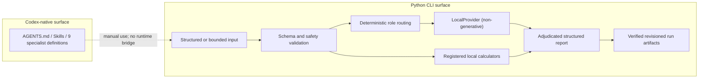

# poker-deliberation-framework

Local-first Python research toolkit for auditable retrospective poker calculations, bounded NLHE
review workflows, and structured run artifacts.

No-Limit Texas Hold'em（NLHE）の事後検討を対象に、型付き入力、ローカル計算、明示的な前提、
検証記録、承認境界を1つのCLIへまとめた研究プロトタイプです。Codex向けの専門Skillと
エージェント定義も同梱しますが、CodexとPython CLIは別実行面です。

> **Status: Experimental functional prototype (0.1.0).** ローカル計算と限定されたoffline
> review workflowは実装済みです。外部モデル・外部solver、full-game GTO、一般自然言語解析、
> CI matrix、配布artifactのrelease検証、独立した戦略品質検証は未完了です。

## 解決したい問題

ポーカーのレビューでは、入力不足、暗黙のレンジ、chip EVと賞金EVの混同、未実行solverを根拠にした
GTO表現、計算過程を再現できない数値が結論へ混ざりやすくなります。このプロジェクトは、事後分析の
入力・仮定・計算・反証・承認・成果物を構造化し、どこまでが確認済みかを追跡しやすくします。

## できること

- 22個の登録済みローカルtoolで、pot odds、EV、ICM、heads-up NLHE equity、combo、
  small zero-sum matrix game、固定相手戦略へのbest responseなどを計算する。
- strictなPydantic schema、上限、単位、前提、`numeric_exactness`、verification metadataを
  `ToolResult`へ記録する。
- 構造化hand、限定されたkey-value形式、文書化済みの有限な日本語NLHE cash grammarを
  fail-closedで検証する。
- 明示確認した単一opponent rangeとriver decisionを、限定されたexact equity / zero-rake call EV
  workflowへ接続する。
- review runをimmutable revision、manifest、hash、approval record、再現コマンド付きで保存する。
- Codex上では、同梱Skillと9つの専門エージェント定義を使って、必要な役割だけを選ぶレビューを行う。

## しないこと

- full NLHE game tree、CFR、node locking、収束確認済みGTO/equilibriumを計算しない。
- Python CLIの既定`LocalProvider`は、LLMによる専門文章や戦略推奨を生成しない。
- `OpenAIAgentsProvider.analyze`と外部solver実行は未実装で、SDKやAPI keyがあっても無効である。
- 一般自然言語、OCR、PokerStars/GGPoker等のsite固有hand historyを自動解析しない。
- live play中の意思決定支援、無条件の推奨アクション、実戦相手rangeの正確性を主張しない。
- Codexのsub-agent実行をPython run artifactへ自動記録しない。

## 現在の実装状態

| 領域 | 状態 | 実行上の意味 |
|---|---|---|
| ローカルcalculator / validator | **Implemented** | 22 toolをstrict inputとtyped resultで実行する。toolごとにexact / verified / approximate / unavailableを区別する。 |
| Offline review CLI | **Implemented** | 構造化入力と限定grammarから、LocalProvider、許可済みtool、terminal artifactへ接続する。 |
| River range-equity bridge | **Implemented** | `P3-016B`は明示確認済みの単一rangeを、最大990 comboのexact-only heads-up river equityへ限定接続する。 |
| Codex workflow | **Implemented** | `AGENTS.md`、3 Skill、9 specialist定義をCodex上で利用できる。 |
| Python上のrole routing | **Partially implemented** | 7 roleを決定的に選び直列実行するが、既定providerは非生成で、独立した専門分析本文を生成しない。 |
| Multi-agent integration | **Experimental** | Codex側はagent機構を使う。Python側とのruntime bridgeはなく、同一runとしての統合実行ではない。 |
| Evaluation | **Experimental** | repository-owned synthetic fixtureのexact-evidence評価はある。外部dataset、人間rubric、戦略品質評価はない。 |
| Process isolation | **Partially implemented** | Windows Job Objectで固定synthetic helperだけを制御する。一般process sandboxやnetwork isolationではない。 |
| External model / solver | **Unavailable** | provider boundaryと正直なUnavailable adapterだけがあり、外部実行はしない。 |
| Full NLHE equilibrium | **Unavailable** | GTO、node locking、full-game equilibrium、正確な実戦rangeは出力しない。 |

**FACT**: milestone/RMの公開状態と技術契約の正は、schema 12.0.0のpublic projectionである

このprojection単体は、特定candidateのtest、build、release readinessを証明しません。機械可読な正本は
[`src/poker_deliberation/roadmap_status.json`](src/poker_deliberation/roadmap_status.json)、
利用者向け一覧は[Capabilities](docs/capabilities.md)と
[Public roadmap status](docs/roadmap-status.md)です。

## Architecture



Python applicationがstate transition、budget、tool execution、artifact publicationを所有します。
Codexは別途、repository instructionsとSkillを読んで専門役を起動します。詳細は
[Architecture](docs/architecture.md)と
[Runtime conformance contract](docs/runtime-conformance-contract.md)を参照してください。

## Requirements

| 項目 | 要件・確認状態 |
|---|---|
| Python | `pyproject.toml`ではCPython 3.11以上。今回の手順はWindows 11 / Python 3.12.13で確認。 |
| OS | WindowsとUbuntuはcandidate matrix。全version・全OSのCI検証はなく、未実行行は**UNKNOWN**。 |
| GPU | 現在のローカル経路では不要。 |
| Network | 依存package取得時だけ必要。同梱CLIの既定ローカル計算・reviewは外部送信しない。 |
| API key | 不要。`OPENAI_API_KEY`を設定しても未実装providerは有効にならない。 |
| GitHub CLI | repository公開作業だけの任意依存。通常利用には不要。 |

P2-028Aのisolated-job機能だけはWindows専用です。通常calculatorはin-processで、OS-level CPU / memory
sandboxを持ちません。Windowsではclone先とtemp/run rootの合計path長にも制約があります。
[Limitations](docs/limitations.md)を先に確認してください。

## Quickstart

PowerShellで、リポジトリをcloneしてeditable installします。`requirements.lock`の取得には
networkが必要です。

```powershell
git clone https://github.com/guriguri215-lang/poker-deliberation-framework.git
cd poker-deliberation-framework
py -3.12 -m venv .venv
.\.venv\Scripts\python.exe -m pip install -r requirements.lock
.\.venv\Scripts\python.exe -m pip install --no-deps --no-build-isolation -e .
```

POSIXではPython実行pathを`./.venv/bin/python`へ置き換えます。Ubuntuでの全gate実行結果は現在
**UNKNOWN**です。

まず診断を実行します。

```powershell
.\.venv\Scripts\python.exe -m poker_deliberation doctor
```

最上位の`"status": "ok"`は診断が完了した意味です。個別能力には`disabled`や`unavailable`も
残るため、同じ出力の`capabilities`を確認してください。

## Minimal example

同梱入力でpot oddsを計算します。

```powershell
.\.venv\Scripts\python.exe -m poker_deliberation calculate pot_odds `
  --analysis-scope retrospective `
  --input examples\pot_odds_input.json
```

代表的な出力は次のとおりです。

```json
{
  "numeric_exactness": "floating-verified",
  "output": {
    "required_equity": 0.25,
    "required_equity_percent": 25.0
  },
  "status": "success",
  "verification": {
    "passed": true
  }
}
```

次に、誤ったUSER_CLAIMをreview workflowで訂正できます。

```powershell
.\.venv\Scripts\python.exe -m poker_deliberation review-strategy `
  --file examples\wrong_pot_odds_case.json `
  --format summary
```

このfixtureでは`USER_CLAIM=0.3333333333`に対し、`CALCULATED=0.25`が報告されます。完全な
input、tool result、verification、agent execution recordは`.poker-run-revisions/`、durable budgetは
`.poker-budget-revisions/`へ保存されます。

CLI全体は次で確認できます。

```powershell
.\.venv\Scripts\python.exe -m poker_deliberation --help
.\.venv\Scripts\python.exe -m poker_deliberation list-tools
.\.venv\Scripts\python.exe -m poker_deliberation list-agents
```

終了コードは、正常完了`0`、入力・計算失敗または`failed_with_limitations`が`2`、承認待ちが`3`です。
各toolのschema、上限、単位、前提、verificationは
[Tool contracts](docs/tool-contracts.md)にあります。

## Use cases

- **Implemented**: pot odds、rake、SPR、MDF、EV、ICMを、明示した入力と仮定の下で比較する。
- **Implemented**: NLHE handのカード・action・pot整合性を検証し、no-rake cash profileでside potを再構成する。
- **Implemented**: heads-up equity、range combo、small matrix game、固定相手戦略へのbest responseを計算する。
- **Implemented**: Codex上でhand review、数値監査、反証、根拠調査を必要な専門役へ分ける。
- **Planned / unavailable**: 外部modelやcommercial solverを接続し、full-game戦略を自動生成する。

Codexで試す場合は[コピー可能な日本語プロンプト](docs/example-prompts.md)を参照してください。
`$review-poker-hand`、`$run-poker-calculation`、`$audit-poker-claim`の3 Skillを同梱しています。

## Validation and testing

このrepositoryはunit、property、integration、golden、adversarial、fault、concurrency testを含みます。
テスト数だけを品質保証とは扱わず、数値toolではtool-specific invariant、独立oracle、tolerance、
failure modeを個別に記録します。

開発用venvを有効化して、次の4 gateを実行します。

```text
python -m pytest
ruff check .
ruff format --check .
mypy src
```

PowerShellでは同じgateを[`scripts/check_quality.ps1`](scripts/check_quality.ps1)から順に実行できます。
公開候補のローカル監査は[`scripts/public_preflight.py`](scripts/public_preflight.py)を使います。

```powershell
.\.venv\Scripts\python.exe scripts\public_preflight.py `
  --repo . `
  --format json `
  --output tmp\public-preflight.json
```

現在`.github/workflows/`はなく、remote CI、coverage threshold、wheel/sdist、clean-install matrix、
外部solverや専門家による独立検証は**UNKNOWN**または未実装です。

## Known limitations

- `holdem_equity`はheads-upのみ。multiway equityとPLO equityは未対応。
- ICMはfuture-game、skill edge、risk preference、bounty、deal modelを含まない。
- best responseはsmall finite acyclic gameと固定相手戦略に限定され、equilibrium resultではない。
- bounded Japanese grammarは一般自然言語理解ではなく、対応siteは`none`。
- local calculatorのwork capはあるが、一般的なprocess sandbox、network isolation、secure erase、
  at-rest encryptionはない。
- redactionは一般的なsecret形状を対象とし、任意の個人情報や全encodingを検出する保証はない。
- Python/Codex間bridge、外部provider、外部solver、automatic retry、通常経路のparallel executionはない。
- Python APIの利用者は任意`AgentProvider`を注入できる。custom providerの外部送信をrepository側が
  一律に禁止・承認拘束するわけではないため、callerが別途監査する必要がある。
- pre-1.0のためCLI、schema、artifact contractには破壊的変更の可能性がある。
- verified OS/Python matrix、scale benchmark、published release、remote CIはない。

全項目と技術的な境界は[Current limitations](docs/limitations.md)を参照してください。

## Project structure

```text
.agents/                    Codexで利用する3つのSkill
.codex/                     Codex project設定と9 specialist定義
docs/                       architecture、capability、contract、limitations
examples/                   実行可能なhand / calculation fixture
scripts/                    evaluation、生成、quality、public preflight
src/poker_deliberation/     Python package、CLI、tools、storage、evaluation
tests/                      unitからfault/concurrencyまでのtest suite
tools/manifest.yaml         生成・検証対象のtool manifest
```

`user_materials/`は未検証の手持ち資料用で、READMEと`.gitignore`以外は追跡しません。秘密情報を
置かず、コードやmacroを自動実行しないでください。

## Documentation

- [Architecture](docs/architecture.md)
- [Capabilities](docs/capabilities.md)
- [Tool contracts](docs/tool-contracts.md)
- [Calculation policy](docs/calculation-policy.md)
- [Hand rule profile](docs/hand-rule-profile.md)
- [Range grammar](docs/range-grammar.md)
- [Range-equity bridge](docs/range-equity-bridge.md)
- [Bounded natural-language intake](docs/bounded-natural-language-intake.md)
- [Bounded river call EV](docs/bounded-river-call-ev.md)
- [Security](docs/security.md)
- [Limitations](docs/limitations.md)
- [Public release checklist](docs/public-release-checklist.md)
- [Roadmap status](docs/roadmap-status.md)

## Roadmap

実装済み項目、進行中項目、計画は[Public roadmap status](docs/roadmap-status.md)で分離しています。
release readinessはroadmap itemの完了とは別に、candidate commitへ結び付いたbuild、install、matrix、
license、artifact hash、preflight evidenceを必要とします。

## License

このrepository独自コードは[MIT License](LICENSE)です。外部dependencyとfixtureにはそれぞれの
license・利用条件が適用されます。
