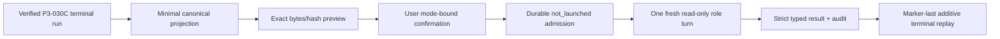

# P2-025B 限定Codex/Python river review bridge

この文書は、terminal verificationに成功した1つのP3-030C river call-or-fold runを、既存の
deterministic evidenceを変更せずに5つの限定review roleへ渡すP2-025B contractを定義します。
一般Codex/Python bridge、自然言語parser、range推定、solverまたはGTO機能ではありません。
P3-030Fは、このcontractを変更せず、1つのverified workflowから次のroleだけをpreview、全field確認、
1回のexecuteへ進めるsupervised wrapper lifecycleを追加します。

## 公開状態

- **FACT**: bridge/auth/canonical/storage core schemaは`1.0.0`、execution auditとsealed live qualification schemaは`2.0.0`である。
- **FACT**: `local_only`はAPI key、ChatGPT/Codex login、外部model、networkを必要としない。
- **FACT**: `codex_subscription`は保存済みChatGPT/Codex loginを使う標準AI経路であり、API keyを
  子processへ渡さない。
- **FACT**: `openai_api`はdefault-disabledの任意contractで、API key、従量課金、retentionは利用者が
  管理する。subscription/API/model間fallbackはない。現在はversioned price authorityとprovider hard
  cost stopがないため、明示選択してもprocess/network起動前に`not_launched`で拒否する。
- **FACT**: deterministic contract evaluationはactual model executionの証拠ではない。
- **FACT**: P3-030F wrapperはworkflow plan、linkage、current bridge lineage、次の固定roleへ確認を
  cross-bindし、exact P2 confirmationを`binding_sha256`付きのworkflow-owned canonical receiptへ保存する。
  自動確認・再確認、一括・並列実行、retry、skip、新mode、mode/model/provider fallbackを許可しない。
- **FACT**: 固定synthetic P3-030C・5 role経路にはcandidate-bound historical sealed live evidenceがある。
  そのmanifestは過去candidateの証拠としてbytes不変で保存し、current treeの資格へ昇格しない。
- **UNKNOWN**: current treeと一致するfresh strict canonical V2 manifestは現在のcanonical pathにない。
  public preflightは`subscription_live_qualified=false`とし、現行live資格を主張しない。
- **UNKNOWN**: strategy quality、human usefulness、正確な実戦range、backend immutable model snapshotは
  transport qualificationからは確定しない。
- **FACT**: このmilestoneではAPI live qualificationを行わない。API adapterはlive-unqualifiedである。

## Installと依存関係

default installはPydanticだけを必須とし、Codex/API packageをimportしません。

```powershell
py -3.12 -m venv .venv
.\.venv\Scripts\python.exe -m pip install -e .
.\.venv\Scripts\poker-deliberate.exe --help
```

subscriptionまたはAPI adapterを利用する人だけが同じpinned packageを明示導入します。

```powershell
.\.venv\Scripts\python.exe -m pip install -e ".[codex-subscription]"
# または
.\.venv\Scripts\python.exe -m pip install -e ".[openai-api]"
```

| 項目 | 固定値 |
|---|---|
| Python | `>=3.11`; qualification環境はCPython `3.12.13` |
| package | `openai-codex==0.144.4` |
| bundled CLI | `openai-codex-cli-bin==0.144.4` / `codex-cli 0.144.4` |
| license | Apache-2.0 |
| binary SHA-256 | `51398051c2332b6afe08dc3b9dbb4056085c197f35ca57a307ee303d450cada5` |
| Node.js | 不要 |

versionとlicenseは`pyproject.toml`、`requirements.lock`、installed distribution metadataで検査します。
Codex CLIのsaved-login、non-interactive mode、structured output、configurationについてはOpenAI公式の
[authentication](https://developers.openai.com/codex/auth)、
[non-interactive mode](https://developers.openai.com/codex/noninteractive)、
[CLI reference](https://developers.openai.com/codex/cli/reference)、
[configuration reference](https://developers.openai.com/codex/config-reference)を参照してください。

## 3つのruntime/auth mode

modeはversioned enumとしてrequest、confirmation、pre-execution admission、execution audit、result、
terminal manifest、pointer、replayへ束縛されます。unknown modeはschema/CLIで拒否します。

| mode | interface / provider | credential reference | model / network | 状態 |
|---|---|---|---|---|
| `local_only` | `local_provider` / `local_provider` | `none` | modelなし / networkなし | implemented |
| `codex_subscription` | `codex_exec_json` / configured model provider `openai` / auth boundary `chatgpt` | `codex_home:saved_chatgpt_login` | requested `gpt-5.6-terra`, `medium`, `default`; effective identityは`UNKNOWN` / networkあり | implemented; candidate-bound historical evidenceあり、current qualificationは`UNKNOWN` |
| `openai_api` | `codex_sdk_responses` / `openai_responses_api_no_retry` | `env:OPENAI_API_KEY` | `gpt-5.6-terra`, `medium`, `default` / qualified network executionなし | deterministic contract only, live-unqualified |

`.env.example`は値を空にします。

```dotenv
POKER_DELIBERATION_AUTH_MODE=
OPENAI_API_KEY=
```

環境変数値はmodeを選びません。すべてのbridge CLI commandに`--auth-mode`が必須です。
`OPENAI_API_KEY`が存在する状態で`local_only`または`codex_subscription`を選んでも、API modeへ変化せず、
subscription child processにもその値を渡しません。subscription認証がない場合もAPIへfallbackせず、
API keyがない場合もsubscriptionへfallbackせず、要求modelが使えない場合も別modelへfallbackしません。

### local_only

default packageだけでdeterministic parser、calculator、LocalProvider、storage、terminal replay、evaluationを
利用できます。bridgeのprepare/show/replayもlocal policyを検証できますが、
`execute-bounded-codex-role --auth-mode local_only`はmodel/network transportを起動せず拒否します。
P3-030Fのworkflow-level role用show/confirm/execute wrapperは、3 commandすべてを
`BRW_E_LOCAL_ONLY`で拒否し、runtime directoryやtransportを開始しません。

### codex_subscription

Codex CLIが管理する保存済みChatGPT loginを使います。product codeは`auth.json`、access token、refresh
token、cookie、keyring、credential storeの値を読みません。`codex login status`がexit code 0で、stdout
またはstderrの正確に一方だけが`Logged in using ChatGPT`、もう一方が空であることだけを秘密非表示probe
として確認します。警告等の追加出力、両streamへの重複出力、別のlogin種別、非zero終了はfail closedにします。
このprobeはinformationalであり、actual turnのauth境界は同じ`codex exec` processに固定した
`forced_login_method="chatgpt"`です。configured model providerは`openai`です。

runtimeは各roleをfresh `codex exec --ephemeral --json --output-schema` turnとして起動します。
`--ignore-user-config`、`--ignore-rules`、approval `never`、sandbox `read-only`、history `none`、
repository外のsingle-use CWD/HOME/AppData/TEMPを固定します。保存済み認証の`CODEX_HOME` referenceは
維持しますが、credential subtreeは走査しません。`CODEX_HOME/skills`と`CODEX_HOME/plugins`だけを
boundedに列挙し、全`SKILL.md`をexact file pathで無効化してcontent hashをlaunch直前に再検査します。
shell、web、file-write、MCP、apps/connectors、browser/computer、plugins、nested/multi-agentその他の
tool featureを無効化し、empty tool allowlist以外をfail closedにします。

確認・公開するexact bytes/hashはapplication-owned canonical stdin payloadです。Codexが追加する
platform/system contextを含むactual backend model inputはCLI JSONLから観測できません。requested
`gpt-5.6-terra`、configured provider `openai`、reasoning `medium`、service tier `default`を固定し、
fallbackを許可せずreroute/error itemをfail closedにしますが、effective model/provider/reasoning/service
tierとbackend immutable model versionは**UNKNOWN**です。requested値をobserved値として保存しません。

### openai_api

この経路は公開利用者向けの任意adapter contractですが、現在のbuildはlive executionを許可しません。
将来live qualificationを行う場合のadmission contractとして次をすべて要求します。

- exact `openai_api` mode
- credential reference `env:OPENAI_API_KEY`
- exact outbound canonical bytes/hash
- provider、model、reasoning、service tier
- roleごとのtoken/output/wall-clockと正のcost cap
- API organizationに適用されるretention policy

API key値はschema、log、public/private bridge artifactへ保存・表示しません。親transportはcredential名の
存在だけを確認し、値を取得しません。専用launcherは環境変数名だけを固定allowlistで削除し、key値へ
index/get操作をせず、残った環境をOS継承で同一Python worker内のofficial runtimeへ渡します。親environmentの
他の値はofficial runtimeへ継承しません。このrepositoryはkeyの発行、請求、失効、rotationを管理しません。
このmilestoneではlive APIを実行せず、no-network deterministic transport fixture、schema、missing-keyと
`api_live_execution_unqualified_cost_authority` failureだけをqualifyします。API keyが存在してもworker、
Codex app-server、API turnを起動しません。token usageへ利用者設定のcost capを自己代入してestimateと
見なすことは禁止します。現在のprice authority versionは`null`、provider hard cost stopは`false`です。

APIの価格とdata policyは変わり得ます。OpenAI公式資料も、cost estimateにはtoken利用量の予測と
token単価が必要で、API responseが返すのはtoken countであると説明しています。将来この経路を有効化する
変更では、固定versionのprice authority、入力/出力/cache/reasoning等の課金区分、provider側hard stop、
境界値test、別途承認したlive qualificationが必要です。現在の仕様確認にはOpenAI公式の
[production cost guidance](https://developers.openai.com/api/docs/guides/production-best-practices#text-generation)、
[API pricing](https://openai.com/api/pricing/)と
[API data controls](https://platform.openai.com/docs/guides/your-data)を確認してください。本contractは
Zero Data Retentionを主張しません。

## 入力と送信data flow



送信を許可するcanonical fieldは次だけです。

- canonical hand: variant、table size、currency、Hero、players、button、stacks、board、actions
- focal decision: street、facing actor/action/amount、Hero response、pot/call amount、action indexes
- 明示rangeの限定provenance: grammar/version、notation、target/as-of、combo count/weight、source hash
- exact equity: reduced rational win/tie/loss/equityと評価count
- exact required equity
- exact no-rake/no-future-betting call EV、fold EV、call-minus-fold、call/fold/tie comparison
- P3-030C source/result/artifact/tool evidence hashesとepistemic labels
- bridge run、role、assignment、attempt、parent lineage、expiry、policy、budget、trace fields

送信しないfieldは次です。

- P3-030B/P3-030Cのraw Japanese source textとsource span text
- private hand history、`user_materials/`、既存FinalReportの文章
- API key、ChatGPT token、auth file、cookie、environment dump、credential value
- raw Codex CLI JSONL、stderr、raw model/reasoning trace、session cache
- calculatorへの新規input、未確認range、推定range、solver result
- repository file内容、git diff、任意command、web/MCP/app context

`classification=public`、`usage_classification=redistribution_allowed`、
`model_processing_authorized=true`のrepository-owned fixtureだけをlive qualificationへ使います。
`local_analysis_only`、権利不明、期限切れ、secret/restricted dataはredactionして送るのではなく、authorization
不足として実行前に拒否します。

## 数理とclaim ownership

- **CALCULATED**: P3-030Cが保存したinteger ledger、reduced rational equity、Fraction required equity、
  Fraction call EV、限定model内のcall/fold comparisonだけが数理の正である。
- **FACT**: Codex roleは`hand_validator`、`hand_pot_ledger`、`pot_odds`、`range_validate`、`combos`、
  `holdem_equity`、`raked_call_ev`を再実行しない。
- **INFERENCE / UNKNOWN**: model narrativeはこの2 labelだけを許し、新しい数値、card/range、citation、
  solver result、CALCULATED label、GTO/均衡、無条件推奨を拒否する。
- **USER_CLAIM / ASSUMPTION / UNKNOWN**: range精度と実戦適用性は未検証のまま維持する。

bridge resultは既存FinalReport/P3-030C resultを上書きせず、deterministic factsとmodel inferenceを分離した
加算的typed artifactです。terminal readerはmodelやcalculatorを再実行せず、canonical bytesとhashから
完全replayします。

## Role、lineage、thread

順序は固定です。

1. `strategy-analyst`
2. `math-tool-auditor`
3. `skeptic-falsifier`
4. `adjudicator`
5. `report-writer`

最初の3 roleは同じimmutable sourceを独立に読みます。`adjudicator`は3つすべてをparentとして読み、
多数決で決めません。`report-writer`はadjudicatorだけをparentとし、新しいfact、number、claim、citationを
追加しません。roleごとにfresh assignment、attempt、thread/turnを作り、cross-role、cross-run、cross-mode
reuseを拒否します。mode変更後は新しいrunとconfirmationが必要です。

## Canonical bytes、schema、hash

canonical JSONはUTF-8、BOMなし、NFC、LF、再帰的key sort、空白なし、floatなしです。alternate JSON
spelling、unknown/extra/missing field、unknown enum/label、duplicate ID、unbound evidence、非canonical bytesを
拒否します。

hashは`SHA-256(ASCII domain || NUL || exact canonical bytes)`です。主要domainは以下です。

| artifact | domain |
|---|---|
| request | `poker-bounded-codex-bridge-request-v1` |
| context | `poker-bounded-codex-bridge-context-v1` |
| confirmation | `poker-bounded-codex-bridge-confirmation-v1` |
| admission | `poker-bounded-codex-bridge-admission-v1` |
| role result | `poker-bounded-codex-bridge-role-result-v1` |
| execution audit | `poker-bounded-codex-bridge-execution-audit-v1` |
| run plan | `poker-bounded-codex-bridge-run-plan-v1` |
| execution identity | `poker-bounded-codex-bridge-execution-identity-claim-v1` |
| terminal manifest | `poker-bounded-codex-bridge-terminal-manifest-v1` |
| runtime source inventory | `poker-bounded-codex-runtime-source-inventory-v1` |

requestはrole別の許可conclusion code、`INFERENCE`/`UNKNOWN` label、exact evidence reference一覧、
parent evidence規則、数値・range・citation・`CALCULATED`禁止も含みます。したがってmodelは応答契約を
推測する必要がなく、これらのfieldもexact outbound bytes/hashとconfirmationへ束縛されます。

narrativeは自由文ではなく、`INFERENCE`用と`UNKNOWN`用の安全な2文だけをJSON Schema enumとして許可し、
labelと文を相互拘束します。数値、card/range表記、citation、named strategy/optimality、`CALCULATED`、
日本語・全角・confusableによる言い換えを個別denylistへ依存せずschema境界で拒否します。enum外または
label不一致の応答は`structured_result_invalid`でterminal化し、同じattemptを自動retryしません。

modelが返す`claim_id`も意味を持つ自由入力ではありません。`conclusions`、続いて`uncertainties`の順に
`claim-01`から最大`claim-16`まで重複・欠番なしで付けるだけです。数値、range、strategy名などをIDへ
迂回して格納する応答を拒否します。adjudicatorでは各claimが3 parent resultすべてを個別に参照します。

live qualification manifestのruntime source inventoryは、実行に影響する`src/poker_deliberation/**/*.py`（status-onlyの
`public_preflight.py`と`roadmap.py`を除く）、全`.codex/agents/*.toml`、`pyproject.toml`、lockfile、
live qualification script、public synthetic qualification fixtureのraw bytes/size/SHA-256を含みます。
fresh current canonical evidenceがある場合、preflightはcurrent treeから5 roleのconformanceを再構築し、
manifest内の各exact outbound requestと完全一致させます。historical manifestはcurrent-tree authorityでは
ありません。

CLI previewはexact outbound UTF-8、base64、byte count、plain SHA-256、request/context/policy hash、mode、
provider/model/runtime、credential reference、retention、budgetを表示します。assignmentは人間の承認待ちを
許すため最大7日で失効し、その値を全部一致させたconfirmationは最大15分で失効します。
confirmation/idempotency、admission、execution identity claim、
immutable revision CAS、marker-last terminal publicationを使い、重複実行とreplayを拒否します。

## Budget、retry、timeout、cancel

| 項目 | local | subscription | API |
|---|---:|---:|---:|
| turn / role | 0 | 1 | 1 |
| context bytes / role | 65536 | 65536 | 65536 |
| response bytes / role | 32768 | 32768 | 32768 |
| stream bytes / role | 262144 | 262144 | 262144 |
| wall clock / role | 0 | 120000 ms | 120000 ms |
| input tokens / role | 0 | 24000 | 24000 |
| output tokens / role | 0 | 6000 | 6000 |
| product retry | 0 | 0 | 0 |
| USD cost | n/a | 記録しない | positive capを確認するが、estimate authority不在のためlive実行しない |

run全体上限は5 turns、600000 ms、120000 input tokens、30000 output tokensです。subscriptionのUSD API
costを捏造しません。built-in subscription providerの内部retryは**UNKNOWN**です。API custom providerは
request/stream retryを0へ固定しますが、token/cost capにprovider側hard stopがなく、観測後検査だけでは
費用超過を防止できません。そのため現在のAPI adapterは送信前にfail closedします。

将来API executionをqualifiedにする場合、workerは`thread.turn`をawaitする直前にsecret-free
`turn_launch_intent`をflushします。その後の例外はturn IDを取得できなくても`effect_unknown`として
reconciliationを要求し、自動retryしません。timeout/output cap時はlocal childをterminateし、必要ならkillしますが、remote処理の停止確定とprocess-tree
hard stopは**UNKNOWN**です。そのためlaunch後の不確実な停止は`cancel_unconfirmed`または`effect_unknown`で
terminal化し、自動retryせずreconciliationを要求します。

effect stateは`not_launched`、`launched`、`succeeded`、`failed`、`timed_out`、`cancelled`、
`cancel_unconfirmed`、`effect_unknown`です。crash before launch、after launch before response、after response
before publicationを区別し、admissionはtransportより先にdurable publicationします。

## P3-030F workflow wrapper lifecycle

P3-030Fでは、既存P2-025Bのlower-level request、confirmation、admission、result、audit、replayを
変更せず、verified P3 workflowから次の固定roleだけを操作します。roleごとの最初のcommandは
`show-bounded-river-review-role-request`です。このread-only previewが返す
17個の`confirmation_fields`のplan/linkage/current revision・manifest・inventory・pointer、role/auth、
request/request-bytes/envelope/runtime-policy、runtime identity、model/provider、credential reference、
remote retentionを、利用者がすべて確認します。

次に`confirm-bounded-river-review-role-request`へ全fieldを個別の`--expected-*`として渡します。
確認成功時、wrapperはworkflow plan/confirmation、linkage、role順、17 field、exact P2 confirmationの
identity/hash/expiry、preview/confirmed bridge lineageをrole別canonical receiptへ結びます。このreceiptが
検証できる場合だけ、必須`--runtime-root`を付けた`execute-bounded-river-review-role`が、そのroleを1回
実行できます。runtime rootはsingle-useなので、各roleでrepository内のignore済みnamespaceに別の、まだ
存在しないdirectoryを指定し、前roleのdirectoryを再利用しません。

lower-level `confirm-bounded-codex-role-request`を直接実行しただけではP3-030F workflow receiptにならず、
wrapper statusは`awaiting_confirmation`のままです。P2 confirmation保存後・receipt保存前の中断も、fresh
showの17 fieldと既存confirmationに一致するauthority/confirmation/idempotency IDをwrapper confirmへ
明示すれば、P2 confirmationを再発行せずreceiptを作成できます。admission済みまたはcompleted roleに
receiptがなければ`BRW_E_ROLE_BINDING`でfail closedし、自動修復しません。

statusは、未確認なら
`next_role=<次の固定role>` / `role_state=awaiting_confirmation` /
`next_action=show_role_request`、確認済みなら同じ`next_role` / `role_state=executable` /
`next_action=execute_role`、期限切れなら`role_state=expired` / `next_action=none`、完了なら
`next_role=null` / `role_state=terminal` / `next_action=none`です。`role_request_expires_at`と、存在する場合の
`role_confirmation_expires_at`も表示し、期限切れのshow/confirm/executeは`BRW_E_ROLE_EXPIRED`で停止します。
admission後の`in_progress`または`reconciliation_required=true`のterminal stateは
`BRW_E_ROLE_RECONCILIATION`で停止します。どちらも自動再確認、retry、skip、新mode、fallbackを行いません。
全flagを含む例は
[限定river review workflow](bounded-river-review-workflow.md)を参照してください。

このwrapperは既存P3 `FinalReport`を置換せず、parser、calculator、明示済み単一opponent range、
`hand_validator`、`hand_pot_ledger`、`pot_odds`、`range_validate`、`combos`、`holdem_equity`、
`raked_call_ev`の7-tool exact semanticsを変更・再実行しません。現行の
`codex_subscription` qualificationは引き続き`UNKNOWN`です。

## P2-025B lower-level CLI lifecycle

bridge pathはrepository内のignored `tmp/`または`runs/`配下を推奨します。`--runtime-root`は
tracked repository `.gitignore`がdirectoryとして除外するuntracked scratch namespace（例:
`tmp/bridge-runtime`、`runs/bridge-runtime`）だけを受理します。公開候補、tracked path、ambient/global/
`.git/info`由来だけのignore、link/reparse、`.git`、`user_materials/`、repository escape、既存product
storageとの重複はlaunch前に拒否します。runtime rootは1 role/attemptだけのsingle-useで、次roleでは
別の未作成rootが必要です。prepareはclean checkoutの指定commit/treeとmodule originを検証します。

```powershell
# 1. verified P3-030C sourceからrunをprepare
poker-deliberate prepare-bounded-codex-bridge `
  --source-run-id SOURCE_RUN `
  --bridge-run-id BRIDGE_RUN `
  --bridge-root tmp/bridge `
  --repository-commit COMMIT `
  --repository-tree TREE `
  --auth-mode codex_subscription

# 2. roleごとのexact outbound bytes/hashを表示
poker-deliberate show-bounded-codex-role-request `
  --bridge-run-id BRIDGE_RUN --bridge-root tmp/bridge `
  --auth-mode codex_subscription --role strategy-analyst

# 3. 表示値を転記してmode-bound confirmationを作る
poker-deliberate confirm-bounded-codex-role-request ...

# 4. 明示操作で1 roleだけ実行する
poker-deliberate execute-bounded-codex-role `
  --bridge-run-id BRIDGE_RUN --bridge-root tmp/bridge `
  --runtime-root tmp/bridge-runtime `
  --auth-mode codex_subscription --role strategy-analyst

# 5. modelを再実行せずreplay
poker-deliberate replay-bounded-codex-bridge `
  --bridge-run-id BRIDGE_RUN --bridge-root tmp/bridge `
  --auth-mode codex_subscription
```

後続role requestは先行resultに依存するため、各roleについてshow、利用者確認、confirm、executeを繰り返し
ます。network/model executionを起動する一括commandやautomatic retryはありません。
このlower-level lifecycleのconfirmationはP2-025Bを直接操作するためのものです。P3-030F workflowから
executeする場合は、それだけではworkflow authorizationにならず、fresh workflow showと一致する明示confirmで
workflow-owned receiptを作る必要があります。

## Evaluationとqualification

`scripts/run_codex_bridge_evaluation.py`はrepository-owned MIT fixtureを使い、actual modelを呼ばずに
次をexact-evidence scoreで検査します。

live qualificationの`prepare` subcommandはWindows path上限を避けられる新規ignored `WORK_ROOT`へ
synthetic P3 sourceを作り、次の3つの非秘密bindingを`source_storage_environment`として表示します。
後続の`show`、`confirm`、`execute`を別processで呼ぶ場合は、同じ値をそのprocessへ明示してください。

```powershell
$env:POKER_DELIBERATION_RUNS_DIR = "$WORK_ROOT/source/legacy"
$env:POKER_DELIBERATION_REVISION_RUNS_DIR = "$WORK_ROOT/source/product"
$env:POKER_DELIBERATION_DURABLE_BUDGET_RUNS_DIR = "$WORK_ROOT/source/budget"
```

bindingが欠ける場合はsource terminalの再検証が`run_not_found`でmodel起動前にfail closedします。
このprelaunch failureをmodel attemptやactual live qualificationとして数えません。

- call-positive、fold-positive、tieのP3-030C exact math不変
- raw source非混入、roleごとのminimal context、correct lineage
- 3 mode分離、missing auth、API-key canary、fallback/replay拒否
- API live-unqualified cost authority guard、process/network前`not_launched`、launch-intent後effect-unknown
- schema/hash/model/runtime/tool mutation、secret/prompt-injection canary
- failure/timeout/cancel/effect-unknown、no retry、terminal mutation/replay
- LocalProvider compatibility、solver unavailable、GTO refusal

結果の`transport_qualification=deterministic_fixture_only`と
`live_qualification_sha256=null`は、model未実行を明示します。

actual qualificationを行えるのは`codex_subscription`だけで、repository-owned public synthetic P3-030C fixture、固定
candidate commit/tree、固定5 role、各role直前のexact outbound bytes/hash承認を使います。各turnはexact concrete
`CodexSubscriptionCliTransport`、default auth probe/command/isolation/credential-home解決、hookなし、subclass/
wrapperなしの経路だけを受理します。transportがinterface、runtime binary/source inventory/config、auth boundary、
no fallback、launch intent、request/schema/command、response/event/usage、thread/turnを束縛したversioned attestationを
生成し、controller/audit/replay/qualificationが同じhashを再検証します。raw CLI JSONL、
stderr、auth cache、raw traceはignored local dataにだけ保存し、公開するのはsanitized manifest、input/result
hash、runtime/model/usage/effect/terminal evidenceです。model文章のexact一致は品質metricにしません。

API pathには同じno-network contract evaluationを適用しますが、このmilestoneのqualification manifestは
`api_live_executed=false`かつ`api_production_qualified=false`を維持します。

過去candidateのno-network評価とstrict canonical V2 sealed live manifestは、
`qualifications/historical/3b8772a587f270acccee32e33f3df68187dda418/`へbytes不変で保存しています。
これはhistorical evidenceであり、current canonical pathのmanifestではありません。legacy recordやhistorical
recordへfieldを後付けしたり再hashしてcurrent liveへ昇格せず、fresh V2 manifestはfresh live実行だけから生成します。
live実行はcleanなqualification commit/treeへ
束縛し、その後の最終commitはsanitized evidenceと状態文書を追加します。自己参照commitを捏造せず、
manifest内の全runtime source fileのpath/size/SHA-256と
`poker-bounded-codex-runtime-source-inventory-v1` hashを最終treeで再計算し、qualification commitが
最終commitのancestorであることもpublic preflightで検証します。roadmap状態projectionだけはruntime execution
inventoryから明示的に除外し、public preflight自体はevidence validation pathとしてinventoryへ含めます。

current公開qualificationのexact run ID、qualification commit/tree、role別usage、manifest hash、runtime source
inventoryは、current canonical pathに置かれたschema `2.0.0` manifestだけを正とします。文書へ特定runの値を
複製せず、public preflightがmanifestをstrict canonical loadし、現在treeとの
ancestor/runtime inventory/role conformance/evaluation bindingを検証します。runtime/package/model、
reasoning、service tier、budget、UNKNOWN、API live-unqualified状態も同manifestへ束縛します。subscription経路に
USD API costは記録しません。

attestation hashはunkeyed integrity bindingであり、同一Python process内でrepository code、class、private capability、
subprocess primitivesまで悪意をもってmonkeypatchできるsame-privilege callerに対するauthenticity anchorではありません。
公開claimはclean repository-controlled processとsealed execution evidenceのtrust boundary内に限定します。

current canonical manifest/evaluationが欠落している現在、public preflightの
`p2_025b_public_artifacts`は`UNKNOWN`、`subscription_live_qualified=false`、evidence authority `null`を返します。
current canonical pathに非canonical、invalid、legacy V1 manifestが存在する場合は
`bridge_public_evidence:noncanonical_or_invalid`で`FAIL`するのが正常です。historical evidenceや手動re-hashで
回避せず、fresh liveが生成したstrict V2 manifestをcurrent canonical pathへ公開し、preflight合格後にだけ
current qualified claimを成立させます。

## Data handlingとretention

- `local_only`: remote processing/retentionなし。local bridge artifactは利用者管理。
- `codex_subscription`: ChatGPT/Codex workspace loginで処理する。利用者のworkspace/accountのdata control、
  training、retention、residencyが適用される。repositoryはworkspace設定を判定しないためexact policyは
  **UNKNOWN**としてconfirmationへ記録する。
- `openai_api`: API organization/projectのdata control、retention、residency、billingが適用される。
  repositoryはZDRを仮定しない。

ChatGPT側の扱いはOpenAI公式の
[data controls](https://help.openai.com/en/articles/5722486-how-your-data-is-used-to-improve-model-performance)
または組織向け[enterprise privacy](https://openai.com/enterprise-privacy/)を実行前に確認してください。
policyが特定できなければ送信を承認しない選択が安全です。

## Public/private artifact境界

GitHubへ公開するもの:

- 全source、strict schema、canonical/hash仕様、package/version/license/lock
- mode設定、空値`.env.example`、outbound/excluded field、budget/effect/replay仕様
- repository-owned public synthetic fixture、deterministic evaluation
- sanitized live qualification manifestとinput/result/commit/tree/runtime hash（成功後）
- capability、roadmap、architecture、security、limitations、再現手順、残存UNKNOWN

GitHubへ公開しないもの:

- API key、ChatGPT access/refresh token、auth file/keyring/cookie
- raw CLI JSONL、stderr、raw model/reasoning trace、credential-bearing environment
- private hand history、`user_materials/`実データ、user-specific cache
- ignored progress/test/runtime data、secret canary実値、不要なlocal absolute path

## 残存UNKNOWNとnon-goals

- backend immutable model snapshot、subscription provider内部retry、remote cancellation finality
- 利用者workspace/API organizationのexact retention/training/residency
- strategy quality、human usefulness、正確な実戦range
- 一般自然言語/site/OCR/model parser、複数range、multiway、earlier streets、all-in/side pot/rake/ante/ICM
- external solver、GTO、equilibrium、node locking、solver-derived strategy
- arbitrary command、file edit、web/MCP/apps、nested agent、parallel product runtime、automatic retry
- subscription/API間fallback、API live qualification、prohibited-site automation
- tag、release、package publication
